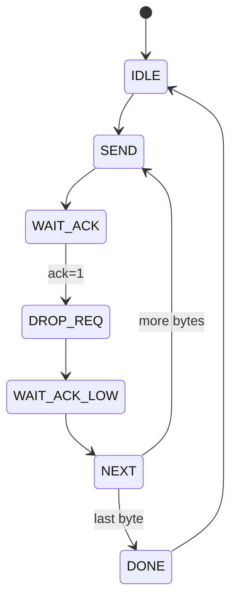
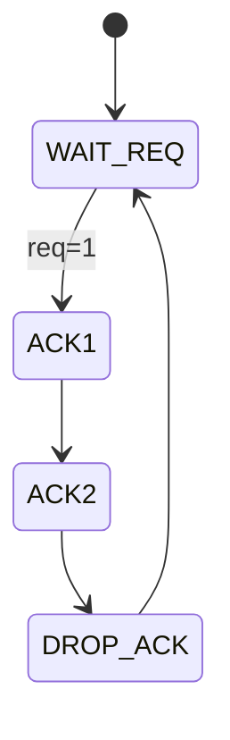

# Problem 4 — Master–Slave Handshake Link

Implements a 4-phase `req/ack` handshake for 4 bytes (`A0`..`A3`).  
- Master sends data, asserts `req`, waits for `ack`.  
- Slave latches data, holds `ack` high for 2 cycles.  
- After 4 transfers, Master pulses `done`.  

## Master FSM

## Slave FSM


## How to run
```bash
iverilog -o sim.out tb_link_top.v master_fsm.v slave_fsm.v link_top.v
vvp sim.out
gtkwave waves/link.vcd
```

